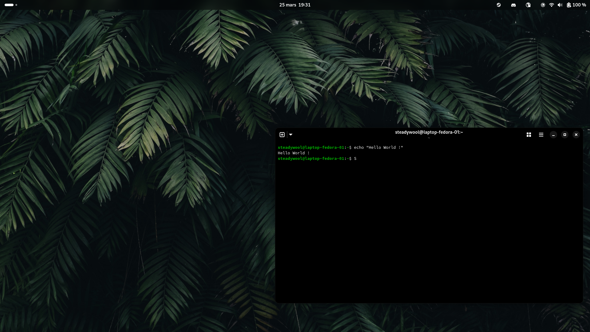

# Configuration 🌸

ArchLinux configuration managed with Ansible.



## Structure

Variables are present in the `ansible/group_vars` & `ansible/roles/ROLE_NAME/defaults` directories. You can edit them to customize your installation.

Here is the partitioning I use:

| Partition               | Mount Options                                                 | Filesystem | Mount Point   |
|-------------------------|---------------------------------------------------------------|------------|---------------|
| `/dev/sda1`             |`nodev,noexec,nosuid`                                          | FAT-32     | `/boot`       |
| `/dev/sda2`             |                                                               | Swap       | [SWAP]        |
| `/dev/sda3`             |                                                               | Luks2      |               |
| `/dev/mapper/luks_root` |`noatime,compress=zstd,subvol=@`                               | Btrfs      | `/`           |
| `/dev/mapper/luks_root` |`nodev,noexec,nosuid,noatime,compress=zstd,subvol=@.snapshots` | Btrfs      | `/.snapshots` |
| `/dev/mapper/luks_root` |`nodev,nosuid,noatime,compress=zstd,subvol=@var`               | Btrfs      | `/var`        |
| `/dev/sda4`             | `nodev,nosuid`                                                | Ext4       | `/home`       |

## Installation

First, follow the [ArchLinux installation guide](https://wiki.archlinux.org/title/Installation_guide) and chroot into your system.

Be sure that Ansible & Git are installed in your system:
```
# pacman -S ansible git
```

Then start the playbook in stage 1:
```
# ansible-pull -U https://github.com/kaniville/ansible-configuration.git ansible/playbook.yml -t stage-1
```

After that, create a password for the root user:
```
# passwd root
```

You can now start your system to finalize the configuration

Connect to your network this way:
```
systemctl start NetworkManager && nmtui
```

Then start the playbook in stage 2:
```
# ansible-pull -U https://github.com/kaniville/ansible-configuration.git ansible/playbook.yml -t stage-2
```

⚠️ **This playbook does not update the system.**

## Configuration

You can perform partially run of playbook using tags. For exemple, to install only dotfiles and start services:
```
# ansible-pull -U https://github.com/kaniville/ansible-dotfiles.git ansible/playbook.yml -t dotfiles,services
```

Available tags are:
- stage-1
- stage-2
- common
- users
- system
- desktop
- packages
- services
- hostname
- timezone
- locale
- boot
- kernel
- user
- dotfiles
- aur
- flatpak

⚠️ **Be sure to change variables in the group_vars directory.**
